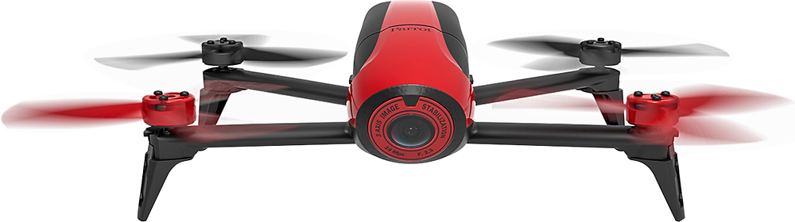
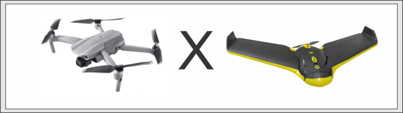

## O que são drones?

Popularmente chamado de ```DRONES```, é tambem conhecido como Veículos Aéreos Não Tripulados ```VANTs``` ou Aeronave Remotamente Pilotada ```ARP```. Na literatura encontramos algumas diferenças entre cada um deles, mas para o caso vale saber que os VANTs foram criados para atuar na área militar, existe registro do uso desde a decada de 80 pela força aérea israelense. Nos dias atuais já são utilizados em diversas aplicações nas mais diversas áreas comercial, industrial, entreterimento, e muito mais...


### Regulamentação de drones no Brasil

No Brasil a regulamentação dos drones é feita em conjunto através de três órgãos: ANAC, ANATEL e DECEA. Cada órgão é responsável por área que envolve a operação dos drones.


### Classes de aeronaves remotamente pilotadas

- Classe 1: RPAs com peso máximo de decolagem maior que 150 kg;
- Classe 2: RPAs com peso máximo de decolagem maior que 25 kg e menor ou igual a 150 kg;
- Classe 3: RPAs com peso máximo de decolagem maior que 250 g e menor do que 25 kg;

Para saber mais acesse o site da [ANAC - Agência Nacional de Aviação Civil](https://www.anac.gov.br/assuntos/legislacao/legislacao-1/rbha-e-rbac/rbac/rbac-e-94)

## Regras de operação sobre Classe3

A ANAC define:

- Ser maior de 18 anos;
- Equipamentos com peso máximo de decolagem acima de 250g precisam ser cadastrados no SISANT;
- É obrigatória a contratação de seguro de responsabilidade civil, chamado de Seguro RETA;
- Altura máxima de voo é de 400 pés ou 120 m de altura. Acima desta altitude é necessário ter uma certificação de pilotagem específica;
- Distância mínima horizontal de 30 metros em relação a pessoas, casas, prédios, veículos e animais.
- Estar afastado pelo menos 5 km de distância de aeródromos (Aeroporto);

E o DECEA - Departamento de Controle do Espaço Aéreo: 

- Para realizar uma operação de voo é necessário solicitar uma autorização de voo junto ao DECEA, através do sistema Sarpas.


 São aeronaves 


!!! progress
    Continuar...

## Dos tipos de VANTs

Os drones são classificados entre os multirotores e os de asa fixa.

### multirotores 

Drones multirotor são construídos com um corpo central e múltiplos rotores que rotacionam hélices para manobrar a aeronave. Os mais comuns são os que possuem quatro (quadricópteros), seis (hexacópteros) ou oito (octacópteros) rotores, mas podemos encontrar drones outras combinações relativas a quantidade de rotores. Uma vez no ar, um drone multirotor varia a velocidade relativa de cada rotor para alterar o torque, permitindo uma gama de movimentos.


### Asa fixa

O drone de asa fixa é um projeto mais tradicional de aeronave, semelhante a um avião. Eles são feitos de um corpo central que tem duas asas e, geralmente, uma única hélice. Uma vez no ar, as duas asas geram sustentação que compensa seu peso permitindo que a aeronave permaneça em vôo.

Por causa disso, eles só precisam usar energia para seguir em frente, não para se manter no ar.


### comparativo



