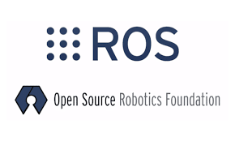
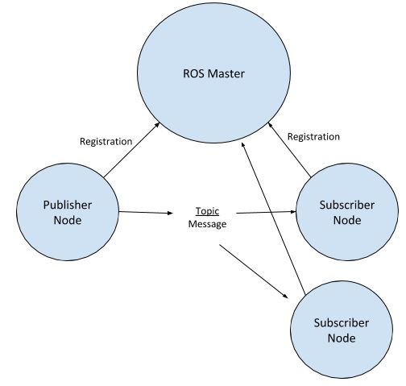

## ROS

O ROS ou Robotic Operation System é basicamente um framework OpenSource para o desenvolvimento de aplicações em robotica. Atualmente é um dos maiores e mais utilizados em projetos de robótica. 

Não precisamos de um conhecimento profundo sobre o ROS para participar da nossa atividade complementar, apenas alguns conceitos básicos já são o suficientes.  

## Conceitos simples que precisamos compreender. 

O ROS é um framework commplexo, não vamos conseguir abordar tudo que a ferramenta oferece. vamos ver apenas conceitos simples para a nossa aula.

### E o que preciso entender de ROS

Compreender como o framework funciona e quem são os principais personagens. Vamos explorar brevemente e entender o básico sobre ROS. 

### ROS MASTER

Tudo começa aqui, o ROS Master faz o controle dos nodes (nós), registra os nodes e acompanha os nós quando novos nós são executados e entram no sistema. O ROS Master estabelece uma alocação dinâmica de conexões. Os nós não podem se comunicar até que o Mestre notifique os nós da existência um do outro. O protocolo mais usado para conexão é o protocolo padrão de controle de transmissão/protocolo de internet (TCP/IP). Uma vez que esses nós são capazes de localizar uns aos outros, eles podem se comunicar entre si P2P (peer-to-peer).

### ROS NODES

A ideia do ROS é facilitar a forma de comunicação entre nós (nodes). Os nodes são basicamente processos que realizam alguma tarefa especifica com a vantagem de se registrar com o nó ROS Master e se comunicar com outros nós no sistema. 

Por exemplo, um nó pode capturar as imagens de uma câmera e enviar as imagens para outro nó para processamento. Depois de processar a imagem, o segundo nó pode enviar um sinal de controle para um terceiro nó para controlar um manipulador robótico em resposta à visão da câmera.

ROS TOPICS

Alguns nós fornecem informações para outros nós, como o exemplo acima. 

Diz-se que esse nó publica informações que podem ser recebidas por outros nós. A informação no ROS é chamada de tópico. Um tópico define os tipos de mensagens que serão enviadas em relação a esse tópico.

Quais os tipos de topicos:

- Publisher - Enviam informações

- Subscriber - Recebem informações

ROS MENSAGES

O ROS mensages define o tipo e o formato dos dados. É nele que sabemos se as msg são do tipo String, float e afins. l de ROS.

### Comandos importantes do terminal que vamos usar bastante

- **rostopic list** - lista os tópicos do ros
- **rosrun exemplo codigo.py** - executa o script codigo.py que está na pasta exemplo
- **rqt_image_view** - abre a câmera do drone
- **rostopic pub --once /bebop/takeoff std_msgs/Empty** - decola o drone 
- **rostopic pub --once /bebop/land std_msgs/Empty** - pousa o drone 
- **rosrun teleop_twist_keyboard teleop_twist_keyboard.py cmd_vel:=/bebop/cmd_vel** - teleoperar o drone com o teclado

Os demais comandos vamos aprender enquanto desenvolvemos nossos códigos.... Partiu lab1!

